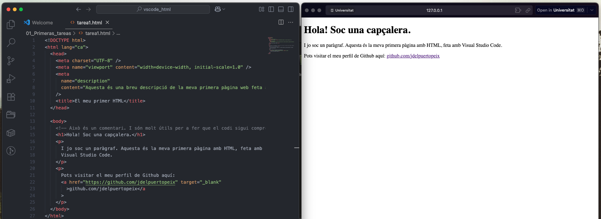

# First HTML Project

This repository contains my first HTML document created from scratch, where I practiced basic best practices in structure and attributes.

Created during the full-stack web development master’s program.

---

## Best Practices Followed

- Opening and closing **all** tags, whether they have content or are empty.
- Respecting the correct order of opening and closing tags, for example:  
  `
Example paragraph with <a href="#">a link</a>
`
- Always writing tag names and attributes in **lowercase**.
- Enclosing attribute values in **double quotes** (`""`).
- Using attributes correctly, such as `lang`, `viewport`, `description`, `target="_blank"`, among others.
- Maintaining a clean, clear, and easy-to-maintain structure.

---

## Project Preview

Below is a screenshot showing the code in Visual Studio Code and the rendered page using the Live Server extension:

